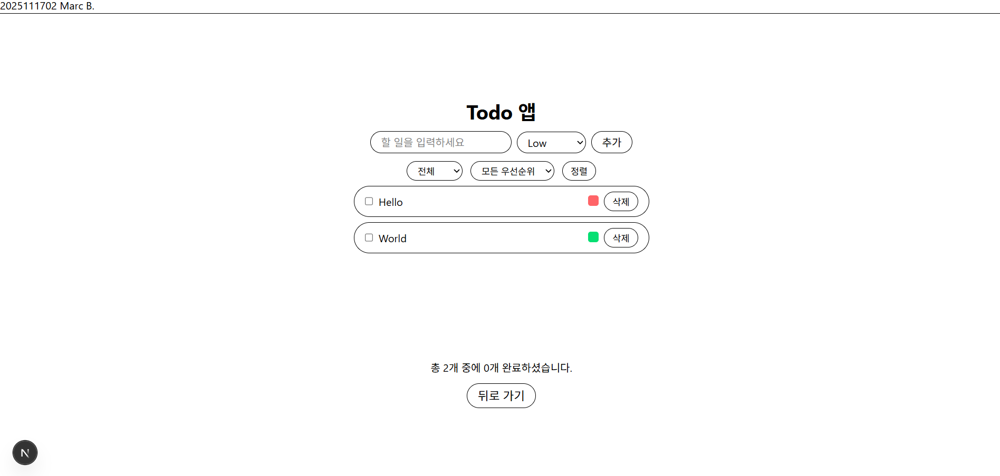

# Todo 앱

## 실행 방법 (Getting Started)
```bash
npm install
npm run dev
```

## Todo 페이지


## 기능 설명 

### 할 일 관리 
- 입력 창에 내용을 넣고  **Enter**를 치거나 **추가**버튼을 눌러서 추가
- 목록에 넣기 전에 중요도 맞추기  (High / Medium / Low)
- 아무 작업을 더블클릭해서 내용 수정
- 색칠된 동그라미를 눌러서 중요도 수정
- 텍스트를 누르거나 체크박스를 눌러서 완료로 바꾸기
- 삭제 버튼으로 작업/내용 삭제

### 필터링 및 정렬 
- 완료도로 정렬: 전체 / 미완료 / 완료
- 중요도로 정렬
- 완료된 작업은 아래로 보내고, 남은 작업은 중요도로 정렬하는 **정렬** 버튼

### 기타 
- 입력된 작업은 브라우저에 저장된다. 즉, 페이지를 나가도 내용은 남는다.
- 목록은 지정범위 내에서 스크롤이 가능함
- **뒤로 가기** 버튼은 전 페이지로 이동하게 함.

## 대략적 설명

### constants
- priority.ts안에 중요도가 저장되어 있다.

### components
- TodoFilter.tsx 안에는 목록 필터링과 정렬 로직이 들어있다.
- TodoItem.tsx 안에는 목록 내용을 수정, 삭제한는 로직이 들어가 있다.

### page.tsx
- 작업 목록을 저장하고, components와 contants를 합성하여 보여주는 todo페이지를 보여준다.